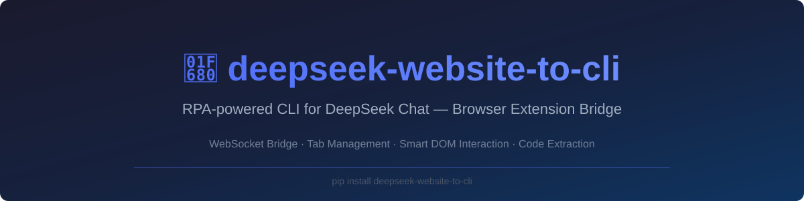

<p align="center">
  
</p>

<p align="center">
  <a href="https://github.com/ishandutta2007/Awesome-Awesome-Awesome"></a><a href="https://discord.gg/jc4xtF58Ve"></a>
  <a href="https://pypi.org/project/deepseek-website-to-cli/"></a>
  <a href="https://github.com/ishandutta2007/deepseek-website-to-cli/blob/main/LICENSE"></a>
  <a href="https://github.com/ishandutta2007"></a>
</p>

# 🚀 deepseek-website-to-cli

> **SEO Description**: RPA-powered command line interface (CLI) and browser extension automation tool for [DeepSeek](https://chat.deepseek.com). Convert DeepSeek web chat sessions into automated terminal workflows without API keys or Cloudflare blocking.

**RPA-powered CLI tool that converts [DeepSeek](https://chat.deepseek.com) website interactions into a command-line interface using a paired browser extension.** 🤖⚡

Instead of reverse-proxying API calls (which get blocked by Cloudflare) or using Selenium (which creates a separate session and is detectable), this tool uses **real browser automation** -- a lightweight browser extension runs inside your actual, logged-in browser and communicates with the CLI via a local WebSocket bridge. 🔌🌐

---

## 🛠️ How It Works

```
+------------------+      WebSocket (localhost)      +---------------------+
|   deepseek-cli   | <===========================>  |  DeepSeek CLI Bridge |
|   (Python CLI)   |      ws://127.0.0.1:18767      |  (Browser Extension) |
+------------------+                                 +---------------------+
        |                                                     |
   Reads prompt                                         Runs inside your
   from file                                            real browser
        |                                                     |
   Outputs code                                         Has access to your
   to terminal                                          logged-in DeepSeek
   or file                                              session & DOM
```

1. **CLI starts** a local WebSocket server 💻
2. **Extension connects** (auto-reconnects every few seconds) 🔄
3. **CLI sends commands**: find DeepSeek tab, paste prompt, wait, extract code 🎯
4. **Extension executes** DOM operations in your real browser ⚡
5. **CLI receives** the result and outputs it ✨

## ✨ Features

- 🛡️ **No Cloudflare blocking** -- uses your real browser session, not Selenium
- 🔑 **Logged-in state preserved** -- runs inside your actual browser profile
- 📑 **Tab management** -- finds existing DeepSeek tabs or opens new ones
- 🧠 **Smart DOM interaction** -- React-compatible prompt pasting
- ⏳ **Response monitoring** -- polls for generation completion
- 📦 **Code block extraction** -- extracts the last code block from responses
- 🎨 **Rich terminal UI** -- spinners, panels, and syntax highlighting
- 📝 **File output** -- optionally append results to a file

## 📥 Installation

### 1. Install the Python CLI 🐍

```bash
pip install deepseek-website-to-cli
```

Or from source:

```bash
git clone https://github.com/ishandutta2007/deepseek-website-to-cli.git
cd deepseek-website-to-cli
pip install -e .
```

### 2. Install the Browser Extension 🧩

1. Open **edge://extensions** (or **chrome://extensions**) in your browser 🌐
2. Enable **Developer mode** (toggle in the bottom-left) ⚙️
3. Click **Load unpacked** 📁
4. Select the `extension/` folder from this repository 📂
5. The "DeepSeek CLI Bridge" extension should appear with a status icon 🟢

> **Note:** The extension auto-connects to the CLI when it's running. You'll see a green indicator in the extension popup when connected.

### 3. Log in to DeepSeek 🔑

Make sure you're logged in at [chat.deepseek.com](https://chat.deepseek.com) in your browser.

## 💡 Usage

### Basic Usage 💻

```bash
# Send a prompt and display the code block result in terminal
deepseek-cli prompt.txt

# Send a prompt and append the result to a file
deepseek-cli prompt.txt -o output.py
```

### Arguments 📋

| Argument | Required | Description |
|---|---|---|
| `prompt_file` | Yes | Path to a text file containing the prompt |
| `-o, --output FILE` | No | Path to output file (result appended). If omitted, prints to terminal |
| `-w, --max-wait SECONDS` | No | Maximum wait time for response (default: 180s) |
| `-p, --port PORT` | No | WebSocket bridge port (default: 18767) |
| `--full-response` | No | Extract full response text, not just the last code block |
| `-b, --browser` | No | Browser to use: `edge` or `chrome` (default: edge) |
| `-v, --verbose` | No | Enable debug logging |
| `--version` | No | Show version |

### Examples 🌟

```bash
# Create a prompt file
echo "Write a Python function that calculates fibonacci numbers" > prompt.txt

# Run with terminal output
deepseek-cli prompt.txt

# Run with file output and extended timeout
deepseek-cli prompt.txt -o fibonacci.py -w 300

# Run with verbose logging for debugging
deepseek-cli prompt.txt -v

# Extract full response instead of just code
deepseek-cli prompt.txt --full-response -o response.md

# Use Chrome instead of Edge
deepseek-cli prompt.txt --browser chrome
```

## 🏗️ Architecture

### Python CLI (`src/deepseek_website_to_cli/`) 🐍

| Module | Purpose |
|---|---|
| `cli.py` | CLI entry point, argument parsing, output formatting |
| `browser.py` | WebSocket bridge server (`DeepSeekBridge`) |
| `deepseek.py` | High-level command orchestration (`DeepSeekAutomation`) |

### Browser Extension (`extension/`) 🧩

| File | Purpose |
|---|---|
| `manifest.json` | Extension config (Manifest V3) |
| `background.js` | Service worker: WebSocket client, tab management |
| `content.js` | Content script: DOM operations on chat.deepseek.com |
| `popup.html/js` | Status popup showing connection state |

### Communication Protocol 💬

Commands flow as JSON over WebSocket:

```json
// CLI -> Extension (command)
{"id": "uuid", "type": "send_prompt", "prompt": "Write fibonacci in Python"}

// Extension -> CLI (response)
{"id": "uuid", "success": true, "data": {"submitted": true}}
```

Available commands: `ping`, `find_deepseek_tab`, `activate_tab`, `open_deepseek_tab`, `send_prompt`, `check_response_status`, `extract_last_code_block`, `extract_full_response`.

## 📦 Dependencies

| Package | Purpose | Pricing |
|---|---|---|
| `websockets` | WebSocket server for CLI-extension bridge | Free / Open Source |
| `rich` | Terminal UI (spinners, panels, syntax highlighting) | Free / Open Source |
| `chardet` | Character encoding detection for file I/O | Free / Open Source |

## 🚀 Publishing to PyPI

### Automated (GitHub Actions) 🤖

Create a GitHub release -- the included workflow will build and publish to PyPI automatically.

### Manual 🛠️

```bash
pip install build twine
python -m build
twine upload dist/*
```

## 🔍 Troubleshooting

| Problem | Solution |
|---|---|
| "Extension did not connect" | Make sure the DeepSeek CLI Bridge extension is installed and enabled |
| "No active DeepSeek tab found" | Open chat.deepseek.com in your browser, or let the tool open it for you |
| "Could not find prompt input box" | Make sure you're logged in to chat.deepseek.com |
| "No code blocks found" | Use `--full-response` to get the entire response text |
| Port conflict on 18767 | Use `-p 18768` to specify a different port |
| Response timeout | Increase wait time with `-w 300` |

## 📊 Star History

<div align="center">
<a href="https://www.star-history.com/?repos=ishandutta2007%2Fdeepseek-website-to-cli&type=date&legend=bottom-right">
<picture>
<source media="(prefers-color-scheme: dark)" srcset="https://api.star-history.com/chart?repos=ishandutta2007/deepseek-website-to-cli&type=date&theme=dark&legend=bottom-right" />
<source media="(prefers-color-scheme: light)" srcset="https://api.star-history.com/chart?repos=ishandutta2007/deepseek-website-to-cli&type=date&legend=bottom-right" />

</picture>
</a>
</div>

## 📄 License

[MIT](LICENSE)
